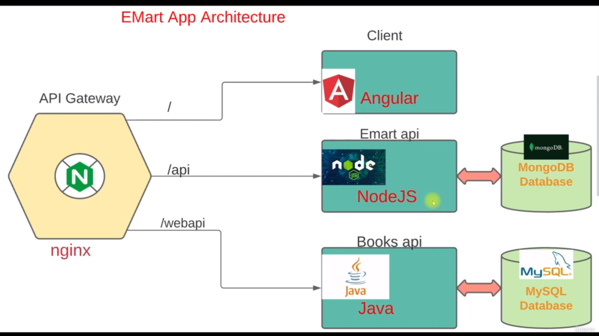

# Emart Microservice Application
We will see deployment of a micro service application. This application was designed by using microservice architecture.

## Project Architecture
<!--  -->

In the front end, you have an API gateway created with Nginx and this listens at three end points,
the root /, /api, /webapi. When the user, access the URL of the website, it will be redirected
to root, which is an app written in Angular.
This will give the frontend and also called client app.
And this will in turn connect to /api, which will be served by an application emart API written
in Node.js.
And it also needs MongoDB database and the MongoDB database.
This application also has a web API, which connects to an application books API.
Which is written in Java.
And this also needs a database, a MySQL database. 

So all these apps that you see over here, Nginx, Angular, Node.js, Java, Mongo, mySQL.
All these will be docker containers

## Pre-Requisite

To complete this project you should have your lab set-up with the appropriate tools.

 - Git, Bash or any Code editor of choice
 - Oracle VirtualBox
 - Install Vagrant, and Vagrant Plugins.

## Installation and Configuration
Clone the repository
  
    git clone  https://github.com/inam6565/emartapp.git
    

Go into the repository emart app
    
    cd emartapp/
    
There you found docker-compose.yml file. In this file we are builing images from different directory like client, web API etc and also running images of nginx, mongo.

Run the docker-compose.yml. It will take some time. because we are building images and images are quite heavy.

    docker-compose up -d
    

Now images are available and containers are running

    docker ps

Look for the localhost ip address 

    ip addr show
    
Go to browser and enter

    http://<you machine ip address>:80
    
Your application is running now. Cheers!!!
